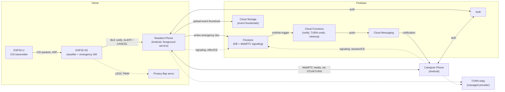
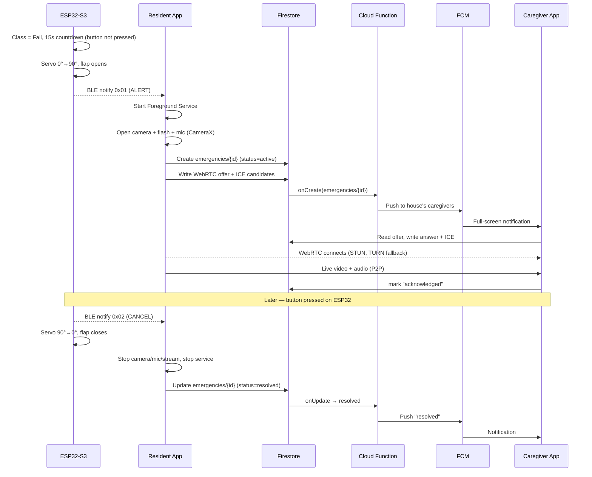
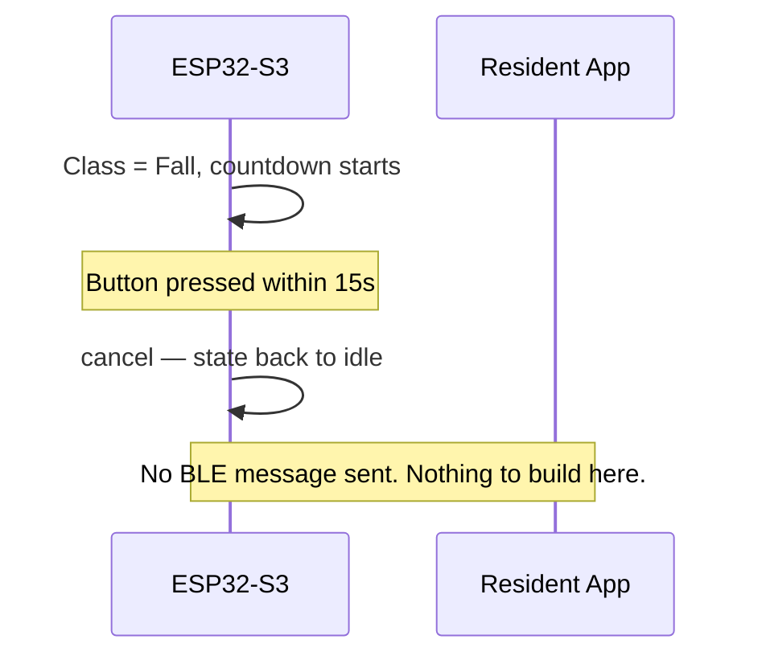
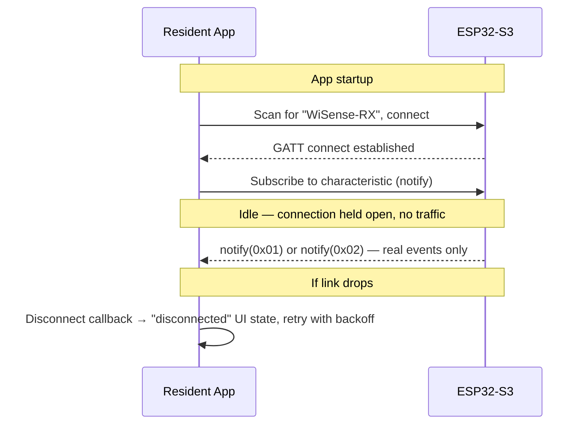
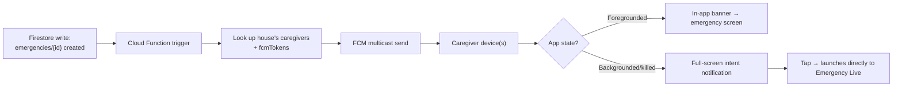

# Wi-Sense — Mobile & Cloud App Architecture

**Status:** architecture handoff — no app code written yet. This is the starting brief for whoever builds the Resident and Caregiver Android apps.

**Scope:** solo/small-team build, near-term target is a handful of pilot houses. Every recommendation below optimizes for "gets built and actually runs," with explicit notes on where and how to scale later — this is not a from-day-one distributed-systems design.

**Firmware status (read this first):** the ESP32-S3 currently classifies room state via a **UART keyboard placeholder** (typing `e`/`p`/`m`/`f` in a serial monitor), not real TinyML yet. This does not block any mobile work — the BLE protocol below is identical either way, and pressing `f` on the firmware side triggers the exact same BLE ALERT a real fall detection would. Build against this doc now; nothing here changes when TinyML lands later.

---

## 0. Getting started checklist

For whoever picks this up first:

1. Read Section 4.1 (BLE protocol) and Section 8 (screens) before writing anything — those are the two sections most likely to be wrong if guessed instead of read.
2. Create a **dev** Firebase project (separate from a future `prod` one — Section 15). Enable: Authentication (Phone provider), Firestore, Cloud Storage, Cloud Functions, Cloud Messaging.
3. Set up the repo layout in Section 16 — `mobile/shared` first, since both apps depend on it.
4. Start with **Phase 1** in the roadmap (Section 17): resident app talks to the real ESP32-S3 over BLE, no camera yet, no cloud yet. Don't build Firebase and camera and BLE in parallel — integrate one thing end-to-end at a time.
5. The 3 defaults in Section 2 (auth method, device type, regulatory scope) are assumptions, not confirmed decisions — confirm or override them before they're load-bearing (auth method matters from Phase 4 onward; device type matters from Phase 2 onward).

---

## 1. System overview



**Key property:** the cloud is on the path for *notification and coordination*, never for *live media*. Video/audio flows resident phone → caregiver phone directly (P2P WebRTC) — this is what keeps latency low and keeps the project off a media-server bill at pilot scale.

---

## 2. Working assumptions (confirm or override before they're load-bearing)

| Decision | Default assumed here | Why | When it starts to matter |
|---|---|---|---|
| Auth method | **Phone number** (Firebase Phone Auth) | Fits "family members," no separate credential to remember | Phase 4 |
| Resident device | **Dedicated device**, not someone's daily phone | Background camera/mic service reliability depends heavily on the OS not aggressively battery-optimizing the app — far easier to guarantee on a device that only runs this | Phase 2 (foreground service setup) |
| Regulatory scope | **Personal/family use, no compliance requirements** (not HIPAA, not a licensed medical device) | Matches current solo/pilot framing | Only if this is ever repositioned for assisted-living facilities or similar — revisit before that happens, not after |

If any of these are wrong, say so before the phase in the last column starts — each one shapes real design decisions downstream (auth flow UI, background-service permission handling, and how much security/audit-trail work is "enough," respectively).

---

## 3. Firmware-side contract (already built, do not need to change)

Everything below already exists in `firmware/components/wisense_ble_trigger/` and `wisense_emergency`. The mobile app is a *consumer* of this, not a co-designer of it — if something here seems awkward, that's a conversation to have, but don't just build around a guess.

### 3.1 BLE protocol — exact values

| Field | Value |
|---|---|
| Advertised device name | `WiSense-RX` |
| Service UUID | `f19e0100-6a2c-418d-9e4a-2f5bc3e09a01` |
| Characteristic UUID | `f19e0200-6a2c-418d-9e4a-2f5bc3e09a01` |
| Characteristic properties | `READ` + `NOTIFY` (no `WRITE` — the phone never sends anything to the ESP32) |
| Value size | 1 byte |
| `0x00` | Idle |
| `0x01` | **ALERT** — fall confirmed (15s countdown expired, button not pressed). Camera/mic/streaming should start. |
| `0x02` | **CANCEL** — physical button pressed after alert fired. Camera/mic/streaming should stop. |
| Security | None — no bonding, no encryption, open GATT | 
| Device identity | Not exposed via a dedicated characteristic. Use the BLE **MAC address** (visible to any central automatically) as the unique device ID when pairing a phone to a specific house's ESP32 — no firmware change needed for single- or multi-device support at pilot scale. |

**Not sent over BLE, and shouldn't be added:** heartbeat, battery status, connection status. The GATT connection state itself (connected/disconnected callback) already tells the phone whether the link is alive — there is no periodic keepalive message to listen for. Battery/connection *telemetry* (of the phone, not the ESP32) is a phone→cloud concern (Section 10), unrelated to this characteristic.

**A cancel *before* the 15-second countdown expires sends nothing at all** — no BLE traffic, because nothing was ever triggered. Only a cancel *after* ALERT has fired sends `0x02`. Don't build UI or logic that expects a "countdown cancelled" BLE message; it doesn't exist and isn't needed (the resident app never even starts a countdown on its side — that's entirely on the ESP32).

### 3.2 Known live firmware issue — check before building Phase 1 on top of it

There is an unresolved BLE stability bug: connections have been observed dropping ~250-340ms after connecting, with HCI disconnect reason `0x13` ("Remote User Terminated Connection" — i.e., the *phone's* Bluetooth stack hangs up, not the ESP32). Suspected cause is Wi-Fi/BLE radio coexistence contention from the ESP32-S3's simultaneous CSI reception. **Confirm this is resolved (or reproduce it) before building Phase 1's "hold a persistent connection from app launch" logic** — if it's still happening, that phase will fail immediately on real hardware regardless of how correct the mobile code is.

---

## 4. Sequence diagrams

### 4.1 Full emergency flow (fall confirmed, not cancelled)



### 4.2 Cancelled during the 15s countdown



### 4.3 BLE connection lifecycle



---

## 5. Database schema (Firestore)

```
users/{userId}
  role: "resident" | "caregiver"
  displayName, phoneNumber
  fcmTokens: [string]
  createdAt

houses/{houseId}
  name
  ownerId: userId
  residentDeviceBleId: string      # the ESP32-S3's BLE MAC, captured at pairing time
  caregiverIds: [userId]           # denormalized for fast security-rule checks
  createdAt

houses/{houseId}/caregivers/{userId}
  addedAt, addedBy
  notificationsEnabled: bool
  role: "primary" | "secondary"

emergencies/{emergencyId}
  houseId
  status: "active" | "acknowledged" | "resolved" | "camera_unavailable"
  triggeredAt, resolvedAt
  triggerSource: "ble_alert"
  acknowledgedBy: [userId]
  cameraAvailable: bool
  thumbnailUrl: string?

emergencies/{emergencyId}/signaling/{peerRole}   # "offer" | "answer"
  sdp: string
  iceCandidates: [object]
  updatedAt
  # short-lived — Cloud Function deletes these once the call ends

devices/{bleMacAddress}
  houseId
  pairedAt
  lastSeenAt
```

`caregiverIds` is deliberately duplicated on the house doc *and* as a subcollection — Firestore security rules need a single-document read to authorize access; a subcollection-only design would cost an extra read on every check.

---

## 6. Technology decisions

| Layer | Choice | Why |
|---|---|---|
| Backend platform | **Firebase** | Zero servers to run; FCM is a Firebase product regardless, so this avoids running two platforms |
| Streaming | **WebRTC**, P2P for v1 | ~200-500ms latency vs. seconds-to-tens-of-seconds for RTMP/HLS — an emergency feed can't tolerate HLS-style delay |
| Signaling | Firestore documents | No signaling server to write or host |
| STUN/TURN | Public STUN + managed TURN (Cloudflare Calls or Xirsys) | ~10-20% of real-world P2P connections need TURN — don't skip it assuming STUN alone is enough |
| Android pattern | **MVVM + light Clean Architecture** (data/domain/presentation), not MVI | The core resident screen is "idle or streaming" — MVI's ceremony doesn't pay for itself at this scope |
| DI | Hilt | Standard, compile-time safe |
| UI | Jetpack Compose | No reason to start a new project on XML in 2026 |
| Camera | CameraX | Lifecycle-aware, handles device fragmentation |
| Background execution | **Foreground Service** (`camera` + `microphone` + `dataSync` types) | The only mechanism Android allows for camera/mic while backgrounded — required, not optional, and gets stricter every OS release |
| State | StateFlow | Coroutine-native, no extra library |

**Multiple simultaneous caregiver viewers is an architecture fork, not a toggle:** pure P2P WebRTC doesn't scale past ~2-4 viewers. Build P2P now; the moment "2+ people watching the same emergency live" becomes a real requirement (not hypothetical), introduce a managed SFU (LiveKit Cloud or similar) rather than trying to retrofit one under pressure.

---

## 7. Reliability — what to do when things fail

| Scenario | Behavior |
|---|---|
| Internet unavailable (resident) | Camera/mic still work locally (not cloud-dependent); emergency doc write retries with backoff; app should surface "no connection — caregiver not notified" locally, since a person physically present should know it didn't go out |
| BLE disconnected | Persistent "device disconnected" state, retry with backoff. No fall detection possible while disconnected — surface loudly |
| Resident phone battery dead | No software mitigation — this is a real single point of failure. Mitigate by warning locally + to cloud below ~20% battery, before it's a hard failure |
| Screen off / phone locked | Foreground Service is what makes this work at all — verify service-type declarations on every targeted Android version, this is the most likely regression point across OS updates |
| Camera/mic/flash permission or hardware unavailable | Non-fatal individually — proceed with what's available, set `cameraAvailable: false` if camera specifically is out, so the caregiver sees "emergency detected, no feed" instead of nothing |
| Firebase offline | Rare given Google's SLAs; Firestore's offline persistence queues local writes. The local camera/mic loop never depended on Firebase reachability anyway |
| Caregiver offline | FCM queues delivery for reconnect; emergency doc is there whenever any caregiver app opens |
| Repeated triggers | Firmware already prevents a second ALERT while one's active — mobile side treats a second ALERT while `status: active` as a no-op |
| Duplicate BLE packets | Not guaranteed exactly-once at the app layer in edge cases (reconnect races) — emergency creation should check for an existing `active` doc for the house before creating a new one |

---

## 8. Screens & UX flow

Not visual mockups — the screen inventory and what each one is responsible for, enough to structure a Compose navigation graph. Visual design is a separate pass.

### Resident app

| Screen | Purpose | Key states |
|---|---|---|
| **Setup / Pairing** | First-run only: sign in, scan for the house's ESP32-S3, confirm pairing, request camera/mic/notification permissions with plain-language explanation | Scanning, found, paired, permission-denied (with re-request path) |
| **Idle** | The screen for >99% of the app's life. Shows "monitoring active," BLE connection status, last-seen timestamp | Connected / disconnected-retrying / disconnected-give-up |
| **Active Emergency** | Shown the instant ALERT is received. Local camera preview, elapsed time, explicit "caregiver has been notified" confirmation. No cancel button here — cancellation is physical, on the ESP32, not in this app | Streaming-connected-to-caregiver / streaming-waiting-for-caregiver / camera-unavailable-fallback |
| **Settings** | Re-pair device, notification preferences, battery-optimization exemption instructions (relevant given Section 2's dedicated-device assumption) | — |

### Caregiver app

| Screen | Purpose | Key states |
|---|---|---|
| **Sign in / Accept invite** | Auth, plus accepting a house invite (Section 12) | — |
| **Home** | List of houses this caregiver has access to (future: more than one), each showing current status at a glance | Normal / active-emergency-in-progress (visually distinct, not a subtle badge) |
| **Emergency Live** | The screen a push notification opens directly into (full-screen intent) — live video/audio, acknowledge action, emergency start time | Connecting / live / camera-unavailable / resolved |
| **History** | Past emergencies for a house, paginated, each showing thumbnail (if captured), duration, who acknowledged | — |
| **House / Caregiver Management** | Owner-only: invite other caregivers, remove access, rename house | — |

---

## 9. Streaming architecture detail

1. Resident app creates the `RTCPeerConnection`, generates an SDP offer, writes it to `emergencies/{id}/signaling/offer`.
2. Caregiver app (listening via Firestore snapshot listener, opened by the push notification) reads the offer, creates its own peer connection, writes an answer to `signaling/answer`.
3. Both sides exchange ICE candidates the same way — write to Firestore, listen for the other side's writes.
4. Once ICE negotiation completes, media flows **directly between the two phones**. Firestore's job ends here.

**Not recording streams server-side in v1** — that needs either a media server in the data path (defeats the point of P2P) or client-side recording + upload (real complexity + storage cost). Cheap partial win instead: resident app snaps and uploads one still frame to Cloud Storage at stream start, so history has *something* visual even if no one was watching live.

---

## 10. Notification architecture



Use FCM **data messages**, not plain notification messages — full presentation control is needed for the incoming-call-style full-screen UI a fall emergency warrants. `IMPORTANCE_HIGH` channel with `setFullScreenIntent`. "Resolved" notifications get a separate, lower-priority channel — the all-clear shouldn't be as jarring as the alert.

---

## 11. Backend architecture

**Cloud Functions (small and focused, not a monolith):**
1. `onEmergencyCreated` — dispatch FCM to the house's caregivers.
2. `onEmergencyResolved` — dispatch "resolved" FCM, clean up the `signaling` subcollection.
3. `mintTurnCredentials` — callable function, short-lived TURN creds on demand. Never ship a static TURN password in the app.
4. `onDeviceProvisioned` — links a newly-paired ESP32-S3 (by BLE MAC) to a house.

No standing server — Cloud Functions' cold start (sub-second for small Node functions) is an acceptable tradeoff for zero idle cost and zero ops at this scale.

---

## 12. Security architecture

| Concern | Approach |
|---|---|
| Authentication | Firebase Auth, phone number (Section 2) |
| Authorization | Firestore security rules keyed on `houses/{id}.caregiverIds` / `.ownerId` |
| BLE security | None currently — acceptable because the characteristic is read/notify-only (no write path the ESP32 accepts), so an attacker in range can eavesdrop on *when* emergencies happen but can't inject a fake one or suppress a real one. Revisit only if a phone→ESP32 write path is ever added. |
| Streaming security | WebRTC's DTLS-SRTP encrypts media by default — nothing extra to build |
| Replay prevention | Signaling docs are single-use per emergency ID — an old offer/answer can't be replayed into a new session |
| Unauthorized caregiver prevention | Explicit invite flow only (owner generates invite, invitee accepts while authenticated) — no self-registration into a house |
| Token refresh | Handled automatically by the Firebase Auth SDK |
| Device registration | Admin action during house setup, not self-service |
| Emergency verification | Deliberately *not* re-verified on the phone or cloud — the 15s countdown + physical button on the ESP32 already is the human-confirmation step |

---

## 13. Deployment

- Separate Firebase projects for `dev` and `prod` — never test against production data.
- GitHub Actions: lint/test on every PR; on merge, build both APKs + deploy Functions, distribute via Firebase App Distribution to testers before any Play Store release.
- Play Store **Internal Testing** track first, Closed Testing once real pilot households are involved, Production only after that's stable.
- Secrets (TURN provider keys, Firebase service account) live in CI secrets — never committed, never in the APK.

---

## 14. Folder structure

```
wi-sense/
├── firmware/                       # existing — this doc doesn't change it
│
├── mobile/
│   ├── resident-app/
│   │   ├── data/                   # BLE client, Firestore repo, WebRTC client
│   │   ├── domain/                 # use cases, emergency state handling
│   │   └── presentation/           # ViewModels, Compose screens (Section 8)
│   ├── caregiver-app/
│   │   ├── data/
│   │   ├── domain/
│   │   └── presentation/
│   └── shared/                     # both apps depend on this
│       ├── ble-protocol/           # Section 3.1's UUIDs + message parsing
│       ├── firestore-models/       # data classes matching Section 5
│       ├── webrtc-core/            # peer connection + signaling helper
│       └── design-system/          # shared Compose theme/components
│
├── backend/
│   └── functions/                  # Cloud Functions (TypeScript)
│       ├── onEmergencyCreated.ts
│       ├── onEmergencyResolved.ts
│       ├── mintTurnCredentials.ts
│       └── onDeviceProvisioned.ts
│
├── docs/
│   ├── app_architecture.md         # this file
│   └── runbooks/                   # "TURN provider down," etc.
│
└── .github/workflows/
    ├── mobile-ci.yml
    └── functions-deploy.yml
```

---

## 15. Roadmap

Each phase produces something testable end-to-end before the next starts.

**Phase 1 — BLE (mobile side)**
Resident app connects to the real ESP32-S3, subscribes to the characteristic, logs ALERT/CANCEL. No camera.
*Milestone:* triggering a real fall on hardware reliably shows "ALERT received" on the phone; survives backgrounding; reconnects after a manual disconnect. **Confirm the coexistence bug (Section 3.2) is fixed before or during this phase.**

**Phase 2 — Camera + mic**
CameraX, local preview, Foreground Service wired to ALERT/CANCEL.
*Milestone:* the physical fall trigger starts a local preview inside a foreground service that survives screen-off; CANCEL stops it cleanly.

**Phase 3 — Streaming (two phones, no cloud)**
WebRTC between two phones, manual/hardcoded signaling to prove the media path before automating it.
*Milestone:* one phone's camera visibly streams to another, same WiFi, acceptable latency/quality.

**Phase 4 — Backend**
Firebase project, Auth, Firestore schema (Section 5), security rules, replace hardcoded signaling with Firestore.
*Milestone:* the Phase 3 stream now negotiates through Firestore and works across two different networks (proves TURN is actually working).

**Phase 5 — Notifications**
FCM, Cloud Functions dispatch, full-screen intent.
*Milestone:* triggering ALERT wakes a caregiver phone (app killed, screen off) to a full-screen notification within a few seconds.

**Phase 6 — Caregiver app (full)**
History, live view, acknowledge, house/caregiver management.
*Milestone:* a caregiver can be invited, sees history, and Section 4.1's full sequence works unattended end-to-end.

**Phase 7 — Security hardening**
Firestore rules audit, real TURN credential minting, invite-flow hardening.
*Milestone:* a deliberate "can user A see house B's data" test suite passes; no secrets in the repo or APK.

**Phase 8 — Production**
CI/CD, Play Store internal testing, a pilot house running unattended for a real trial period.
*Milestone:* runs for at least a week without manual intervention, with Section 7's failure matrix validated against real occurrences, not just the happy path.

---

## 16. Future expansion (not now, but the schema already leaves room)

- **Cheap later:** richer history filtering, multiple houses per caregiver (`caregiverIds` already supports many-to-many), multiple residents per house.
- **Medium:** two-way audio (WebRTC already supports it, mostly a UI addition), claim/acknowledge race handling, emergency-contact calling (`Intent.ACTION_CALL` is trivial — the hard part is *policy*: who's authorized, false-positive liability — a product/legal question before an engineering one).
- **Larger, genuinely new subsystems:** SFU for multi-viewer streaming (the planned fork point, Section 6), wearable panic-button as a second independent trigger path, on-phone ML pre-verification (weigh carefully — cuts against the "camera never runs except during real emergencies" privacy promise).
